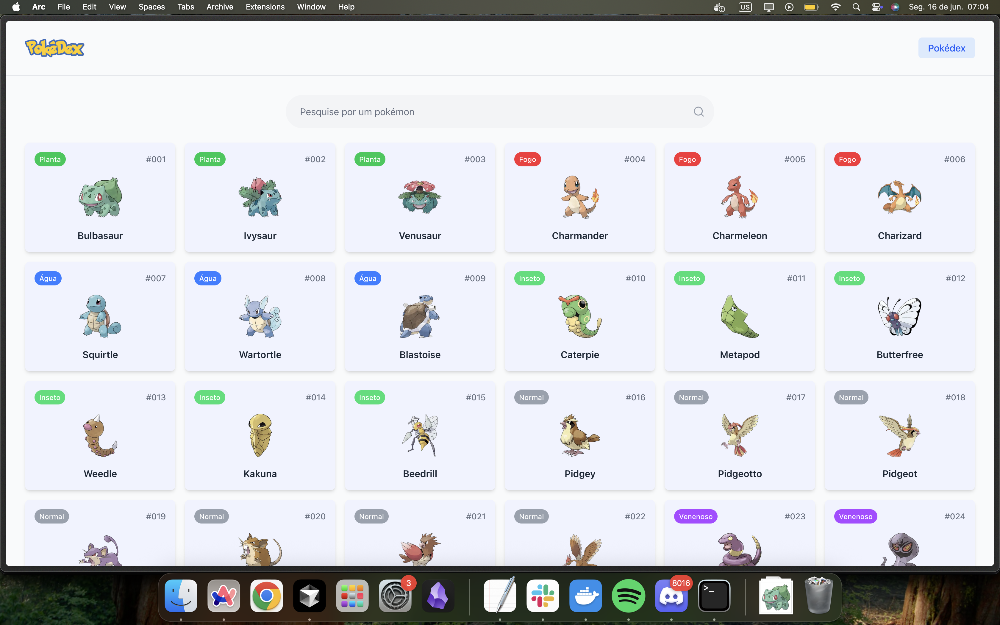

# 🔥 Pokédex - Desafio Pokémon



🔗 **Demo:** https://poke-challenge-five.vercel.app/

Uma aplicação moderna de Pokédex construída com Next.js, TypeScript e Tailwind CSS, oferecendo uma experiência completa para explorar o mundo Pokémon. (Sim, texto melhorado por GPT.)

## 🚀 Por que Next.js em vez de Vanilla JavaScript?

### 1. **Server-Side Rendering (SSR)**

- **SEO Otimizado**: Páginas são renderizadas no servidor, melhorando drasticamente o SEO
- **Performance Superior**: Conteúdo carregado instantaneamente, sem loading states desnecessários
- **Meta Tags Dinâmicas**: Cada Pokémon tem suas próprias meta tags para compartilhamento social

### 2. **Roteamento Automático**

- **File-based Routing**: Sistema de rotas baseado em arquivos (`/pokemon/[id]`)
- **Dynamic Routes**: Rotas dinâmicas para detalhes de Pokémon sem configuração manual
- **Nested Layouts**: Layout compartilhado entre páginas automaticamente

### 3. **Otimizações Built-in**

- **Image Optimization**: Componente `Image` do Next.js otimiza automaticamente imagens
- **Code Splitting**: JavaScript é dividido automaticamente por página
- **Prefetching**: Links são pré-carregados para navegação instantânea

### 4. **Developer Experience**

- **TypeScript Nativo**: Suporte completo ao TypeScript sem configuração
- **Hot Reload**: Mudanças refletem instantaneamente durante desenvolvimento
- **Error Handling**: Páginas de erro customizadas (`404.tsx`, `not-found.tsx`)

## 📁 Estrutura do Projeto

```
src/
├── app/                          # App Router (Next.js 13+)
│   ├── actions/                  # Server Actions
│   │   ├── get-pokemons.ts      # Busca lista de Pokémon
│   │   └── index.ts             # Exportações centralizadas
│   ├── pokemon/[id]/            # Rotas dinâmicas de Pokémon
│   │   ├── page.tsx             # Página de detalhes
│   │   └── not-found.tsx        # 404 específico para Pokémon
│   ├── globals.css              # Estilos globais + Tailwind
│   ├── layout.tsx               # Layout raiz da aplicação
│   ├── loading.tsx              # Loading UI global
│   ├── not-found.tsx            # Página 404 geral
│   └── page.tsx                 # Página inicial (lista de Pokémon)
├── components/                   # Componentes reutilizáveis
│   └── ui/                      # Componentes de interface
│       ├── header.tsx           # Cabeçalho com navegação
│       ├── pagination.tsx       # Componente de paginação
│       ├── pokemon-card.tsx     # Card individual de Pokémon
│       ├── pokemon-type-badge.tsx # Badge de tipos de Pokémon
│       ├── search-input.tsx     # Input de busca com debounce
│       └── skeleton.tsx         # Componentes de loading
├── constants/                    # Constantes da aplicação
│   └── navigation-links.ts      # Links de navegação
├── types/                       # Definições TypeScript
│   └── pokemon.ts               # Interfaces dos dados Pokémon
└── utils/                       # Utilitários e helpers
    └── translations.ts          # Traduções PT-BR
```

## 🛠️ Tecnologias Utilizadas

### **Core**

- **Next.js 15**: Framework React com App Router
- **React 19**: Biblioteca de interface com Server Components
- **TypeScript**: Tipagem estática para maior confiabilidade

### **Styling**

- **Tailwind CSS**: Framework CSS utility-first
- **Lucide React**: Ícones modernos e consistentes

### **Data Fetching**

- **PokeAPI**: API oficial dos dados Pokémon
- **Server Actions**: Busca de dados no servidor

### **Developer Tools**

- **ESLint**: Linting de código
- **PostCSS**: Processamento de CSS

## ✨ Funcionalidades Implementadas

### 🔍 **Busca e Navegação**

- Busca em tempo real com debounce (500ms)
- Paginação inteligente com navegação por URL
- Navegação por teclado e acessibilidade

### 🎨 **Interface Moderna**

- Design responsivo para todos os dispositivos
- Skeleton loading para melhor UX
- Animações suaves e transições
- Tema consistente com cores dos tipos Pokémon

### 🌐 **Internacionalização**

- Interface completamente em Português (PT-BR)
- Tradução de tipos Pokémon (Fire → Fogo, Water → Água)
- Tradução de estatísticas (Attack → Ataque, HP → PS)
- Formatação de unidades em português

### 📱 **Experiência Mobile**

- Layout adaptativo para smartphones
- Touch-friendly com áreas de toque adequadas
- Performance otimizada para conexões lentas

### 🚨 **Tratamento de Erros**

- Páginas 404 customizadas e temáticas
- Fallbacks para dados não encontrados
- Estados de loading elegantes

## 🎯 Vantagens da Arquitetura Escolhida

### **Performance**

### **SEO**

- Meta tags dinâmicas por Pokémon
- URLs amigáveis (`/pokemon/25` para Pikachu)
- Structured data para rich snippets

### **Manutenibilidade**

- Componentes reutilizáveis e modulares
- Tipagem TypeScript previne bugs
- Estrutura escalável para novas features

### **User Experience**

- Navegação instantânea com prefetching
- Estados de loading consistentes
- Feedback visual em todas as interações

## 🚀 Como Executar

```bash
# Instalar dependências
npm install

# Executar em desenvolvimento
npm run dev

# Build para produção
npm run build

# Executar produção
npm start
```

---
